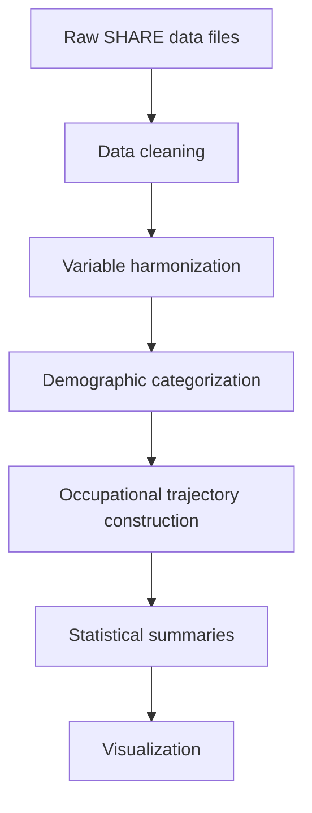

<h1 align="center">Occupational attainment of immigrants in Europe</h1>

Author: Jianji Chen

Email: jianjichen001@gmail.com

Dear friend, thank you for your interest in this project! Please feel free to reach out with any questions or comments.

## Overview
This project develops a reproducible Python workflow for analysing occupational attainment trajectories among immigrants in Europe using SHARE longitudinal data. It integrates data cleaning, harmonization, trajectory construction, visualization, and comparative analyses across European countries.

Please note that this is an onging project and further work and improvment may be updated in the future.

## Research objectives
* Main question: How do immigrants and natives (born) differ in their cumulative chances of accessing “decent” jobs over the life course?
* Comparisons:
  * Origin: European VS non-European
  * Gender
  * Education
  * Destination country

## Data sources
The Survey of Health, Ageing and Retirement in Europe (SHARE), is a research infrastructure for studying the effects of health, social, economic and environmental policies over the life-course of European citizens and beyond.

## Workflow

## Repository structure
In this repository you will find the following documents:
* Summary for research ideas and key results:
    * "outputs_report_es.pdf": a brief report in Spainsh
    * "outputs_slides_en.pdf": slides for a presentation in English
* Scripts of reproducible Python codes:
    * "scripts_01_clean_demographics.ipynb": cleaning and agligning demographic variables across waves
    * "scripts_02_clean_job_history.ipynb": cleaning and agligning employment variables across waves
    * "scripts_03_merge_sample.ipynb": merging harmnizaed datasets, and selecting sample
    * "scripts_04_analysis_visulization.ipynb": producing statistical summaries and plots  

## Reproducibility
All analyses are reproducible from the provided code scripts.

## Data access
Note that if you would like to replicate the results with the codes, please make sure that you get access to the SHARE datasets. All the datasets used here are publicly accessible via application on the official website of the SHARE: https://share-eric.eu/data/data-access

The datasets used here are:
1.	SHARE-ERIC (2024). easySHARE. Release version: 9.0.0. SHARE-ERIC. Data set DOI: 10.6103/SHARE.easy.900
2.	SHARE-ERIC (2024). SHARE Job Episodes Panel. Release version: 9.0.0. SHARE-ERIC. Data set. DOI: 10.6103/SHARE.jep.900
3.	SHARE-ERIC (2024). Survey of Health, Ageing and Retirement in Europe (SHARE) Wave 1. Release version: 9.0.0. SHARE-ERIC. Data set. DOI: 10.6103/SHARE.w1.900
4.	SHARE-ERIC (2024). Survey of Health, Ageing and Retirement in Europe (SHARE) Wave 2. Release version: 9.0.0. SHARE-ERIC. Data set. DOI: 10.6103/SHARE.w2.900
5.	SHARE-ERIC (2024). Survey of Health, Ageing and Retirement in Europe (SHARE) Wave 3 – SHARELIFE. Release version: 9.0.0. SHARE-ERIC. Data set. DOI: 10.6103/SHARE.w3.900
6.	SHARE-ERIC (2024). Survey of Health, Ageing and Retirement in Europe (SHARE) Wave 4. Release version: 9.0.0. SHARE-ERIC. Data set. DOI: 10.6103/SHARE.w4.900
7.	SHARE-ERIC (2024). Survey of Health, Ageing and Retirement in Europe (SHARE) Wave 5. Release version: 9.0.0. SHARE-ERIC. Data set. DOI: 10.6103/SHARE.w5.900
8.	SHARE-ERIC (2024). Survey of Health, Ageing and Retirement in Europe (SHARE) Wave 6. Release version: 9.0.0. SHARE-ERIC. Data set. DOI: 10.6103/SHARE.w6.900
9.	SHARE-ERIC (2024). Survey of Health, Ageing and Retirement in Europe (SHARE) Wave 7. Release version: 9.0.0. SHARE-ERIC. Data set. DOI: 10.6103/SHARE.w7.900
10.	SHARE-ERIC (2024). Survey of Health, Ageing and Retirement in Europe (SHARE) Wave 8. Release version: 9.0.0. SHARE-ERIC. Data set. DOI: 10.6103/SHARE.w8.900
11.	SHARE-ERIC (2024). Survey of Health, Ageing and Retirement in Europe (SHARE) Wave 9. Release version: 9.0.0. SHARE-ERIC. Data set. DOI: 10.6103/SHARE.w9.900
