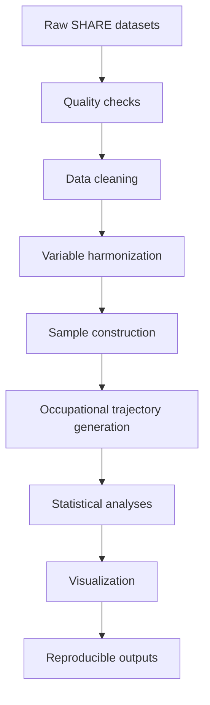

<h1 align="center">Occupational attainment of immigrants in Europe</h1>
<h2 align="center"><em>A reproducible computational workflow for comparative longitudinal survey research using SHARE</em></h2>

Author: Jianji Chen

Email: jianjichen001@gmail.com

Dear friend, thank you for your interest in this project! Please feel free to reach out with any questions or comments.

## Overview
This project demonstrates a reproducible computational workflow for processing and analysing complex longitudinal survey data from the Survey of Health, Ageing and Retirement in Europe (SHARE). The workflow covers data cleaning, harmonization across survey waves, construction of occupational life course trajectories, statistical analysis, and visualization. Although the substantive application focuses on immigrants’ occupational attainment in Europe, the broader objective is to develop transparent, reusable, and well-documented analytical pipelines for comparative demographic research.

Please note that this is an ongoing project and further work and improvement may be updated in the future.

## Research objectives
* Main question: How do immigrants and natives differ in their cumulative chances of accessing “decent” jobs over the life course?
* Comparisons:
  * Origin: European VS non-European
  * Gender
  * Education
  * Destination country

## Data sources
The Survey of Health, Ageing and Retirement in Europe (SHARE), is a research infrastructure for studying the effects of health, social, economic and environmental policies over the life course of European citizens and beyond.

The project combines multiple SHARE components, including the Job Episodes Panel, easySHARE, and several survey waves. Integrating these sources requires harmonization of demographic and occupational variables to construct comparable longitudinal trajectories across countries.

## Workflow

## Repository architecture
In this repository you will find the following documents:
* Summary for research ideas and key results:
    * "outputs_report_es.pdf": a brief report in Spanish
    * "outputs_slides_en.pdf": slides for a presentation in English
* Scripts of reproducible Python codes:
    * "scripts_01_clean_demographics.ipynb": cleaning and aligning demographic variables across waves
    * "scripts_02_clean_job_history.ipynb": cleaning and aligning employment variables across waves
    * "scripts_03_merge_sample.ipynb": merging harmonized datasets, and selecting sample
    * "scripts_04_analysis_visualization.ipynb": producing statistical summaries and plots  

## Reproducibility
The project follows reproducible research principles. All analytical steps—from data preparation and harmonization to statistical analysis and figure generation—are documented through modular Python notebooks. Version control is managed using Git and GitHub, facilitating transparency, reproducibility, and future extensions of the workflow.

## Technical skills demonstrated
| Area                 | Skills                           |
| -------------------- | -------------------------------- |
| Survey research      | SHARE longitudinal data          |
| Data engineering     | Cleaning, merging, harmonization |
| Programming          | Python                           |
| Reproducibility      | GitHub, Git, modular notebooks   |
| Comparative analysis | Cross-national research          |
| Visualization        | Automated figures                |

## Data access
Due to the SHARE data protection regulations and confidentiality rules, the raw and derived datasets cannot be redistributed or hosted publicly in this repository. If you would like to replicate the results with the codes, please make sure that you get access to the SHARE datasets. All the datasets used here are publicly accessible via application on the official website of the SHARE: https://share-eric.eu/data/data-access

The datasets used here are:
1.	SHARE-ERIC (2024). easySHARE. Release version: 9.0.0. SHARE-ERIC. Data set DOI: 10.6103/SHARE.easy.900
2.	SHARE-ERIC (2024). SHARE Job Episodes Panel. Release version: 9.0.0. SHARE-ERIC. Data set. DOI: 10.6103/SHARE.jep.900
3.	SHARE-ERIC (2024). Survey of Health, Ageing and Retirement in Europe (SHARE) Wave 1. Release version: 9.0.0. SHARE-ERIC. Data set. DOI: 10.6103/SHARE.w1.900
4.	SHARE-ERIC (2024). Survey of Health, Ageing and Retirement in Europe (SHARE) Wave 2. Release version: 9.0.0. SHARE-ERIC. Data set. DOI: 10.6103/SHARE.w2.900
5.	SHARE-ERIC (2024). Survey of Health, Ageing and Retirement in Europe (SHARE) Wave 3 – SHARELIFE. Release version: 9.0.0. SHARE-ERIC. Data set. DOI: 10.6103/SHARE.w3.900
6.	SHARE-ERIC (2024). Survey of Health, Ageing and Retirement in Europe (SHARE) Wave 4. Release version: 9.0.0. SHARE-ERIC. Data set. DOI: 10.6103/SHARE.w4.900
7.	SHARE-ERIC (2024). Survey of Health, Ageing and Retirement in Europe (SHARE) Wave 5. Release version: 9.0.0. SHARE-ERIC. Data set. DOI: 10.6103/SHARE.w5.900
8.	SHARE-ERIC (2024). Survey of Health, Ageing and Retirement in Europe (SHARE) Wave 6. Release version: 9.0.0. SHARE-ERIC. Data set. DOI: 10.6103/SHARE.w6.900
9.	SHARE-ERIC (2024). Survey of Health, Ageing and Retirement in Europe (SHARE) Wave 7. Release version: 9.0.0. SHARE-ERIC. Data set. DOI: 10.6103/SHARE.w7.900
10.	SHARE-ERIC (2024). Survey of Health, Ageing and Retirement in Europe (SHARE) Wave 8. Release version: 9.0.0. SHARE-ERIC. Data set. DOI: 10.6103/SHARE.w8.900
11.	SHARE-ERIC (2024). Survey of Health, Ageing and Retirement in Europe (SHARE) Wave 9. Release version: 9.0.0. SHARE-ERIC. Data set. DOI: 10.6103/SHARE.w9.900
